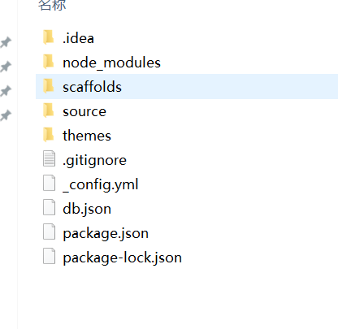
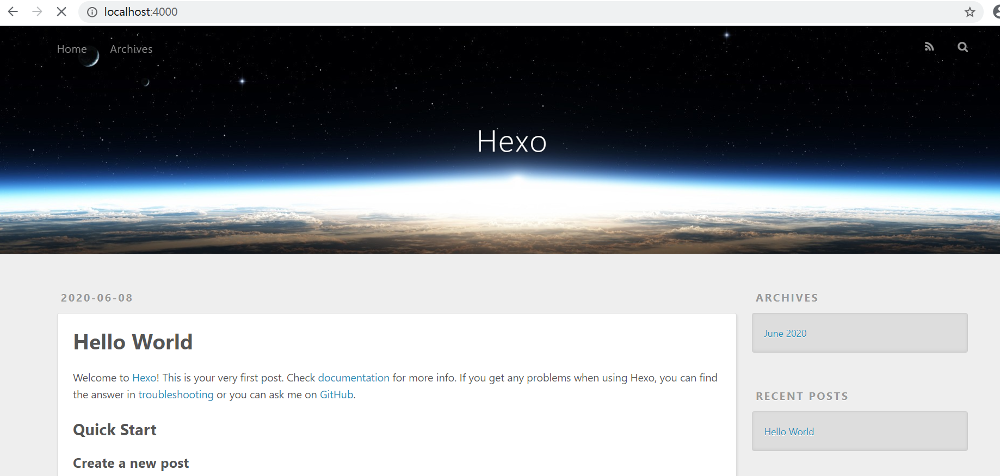
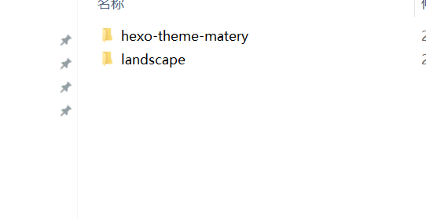

## 从无到有的github博客搭建

### 一、基于Hexo+github的静态博客搭建

#### 1、环境安装
  因为我是windows系统，所以下面的操作都是基于windows环境而言的
  （1）、**Git Bash安装**。我一直不太喜欢使用小乌龟，于是选择git bash进行安装。安装步骤便不再赘述。  [下载地址](https://gitforwindows.org/)

  （2）、**安装NodeJs**。Hexo是基于nodeJS环境的静态博客，里面的npm工具很有用。同样，安装步骤不再赘述   [下载地址](https://nodejs.org/en/)

  （3）、**安装hexo**。看到这么多需要安装的东西，千万不要慌张，这都是开发的必备环境，是比较简单的一些安装操作。建议全局安装hexo，安装命令如下：
````
npm i -g hexo
````

  （4）、需要拥有一个github账号，若没有，[去创建](https://gitforwindows.org/)

#### 2、创建博客
  （1）、在github远程仓库创建一个项目，项目名为username.github.io（比如我的github用户名为youknowhaze，那么我的项目名就是youknowhaze.github.io），github会将该名称的项目发布至远程，进行免费托管。每个github账户仅支持这样一个命名项目的托管。

  （2）、将项目clone至本地目录，进入项目根目录，执行初始化命令
````
hexo init
````
  初始化后的项目结构如下：



  简单解释一下这个结构

| 模块/文件    | 作用                       |
| ------------ | -------------------------- |
| node_modules | 是依赖包                   |
| public       | 存放的是生成的页面         |
| scaffolds    | 命令生成文章等的模板       |
| source       | 用命令创建的各种文章       |
| themes       | 主题                       |
| _config.yml  | 整个博客的配置             |
| db.json      | source解析所得到的         |
| package.json | 项目所需模块项目的配置信息 |


  （3）、启动项目：
````
hexo g    # 构建项目，会在public下生成html页面
hexo d    # 启动项目，启动后本地访问http://localhost:4000
````
初始的博客页面有点丑，访问页面如下：



  （4）、修改主题
  既然默认主题比较丑，那么我们就修改一个自己喜欢的主题，  [官方主题](https://hexo.io/themes/)
  现在使用的博客模板为：  [hexo-theme-matery](https://github.com/youknowhaze/incredible-blog)

  首先修改_config.yml文件中的theme: landscape改为theme: hexo-theme-matery ，然后需要下载模板文件至themes目录下，可以通过clone的方式，也可以下载压缩包进行解压，如下：



  重新启动博客：
````
hexo s  # 启动博客

## 若启动过程中出现报错，可以先清理缓存再启动
hexo clean
````

#### 3、博客样式及组件调整


